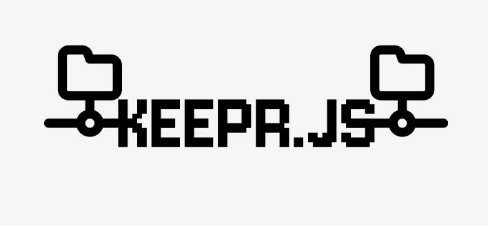

# keepr.js

KeeprJS is a NodeJS service/application plugin which allows developers to configure which files and folders to keep in build directory after compiling/building/bundling. This is useful when dealing with directories and files we generally need inside the build folder. While some features of configurations of some services, applications and frameworks do offer the way of keeping specific file/s inside the build, rarely do they offer the feature of keeping an whole folder within the build and this is where KeeprJS comes into the picture.

## Usage

KeeprJS can be simply installed using:

```
npm install keeprjs
```

And then, set up an simple `keepr.json` configuration file:

```json
{
    "target": "./build-folder",
    "paths": [
        "./folders-to-move"
    ]
}
```

And then, you can manually run `keeprjs` or create an postbuild script that includes running command `keeprjs`.
